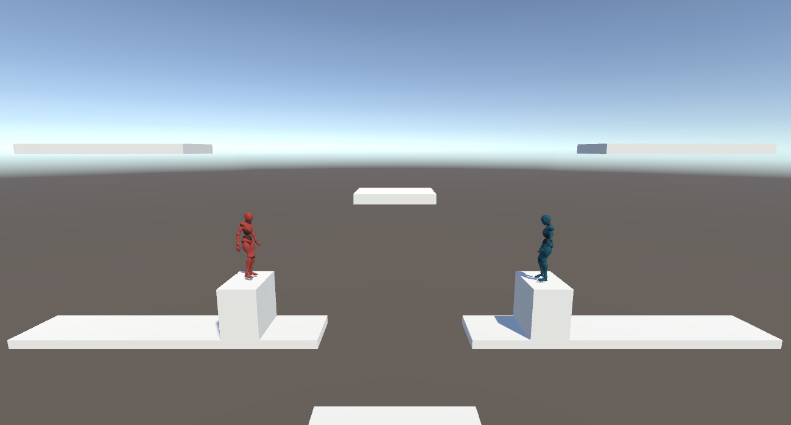
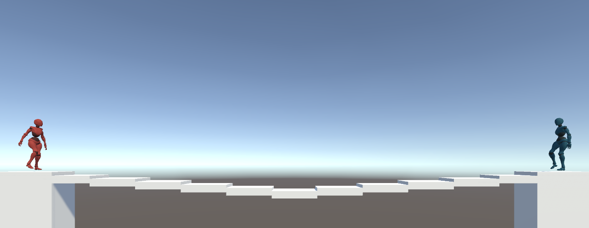
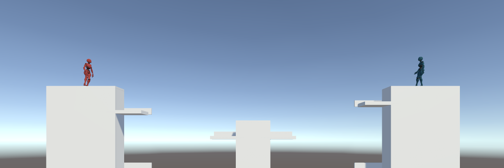
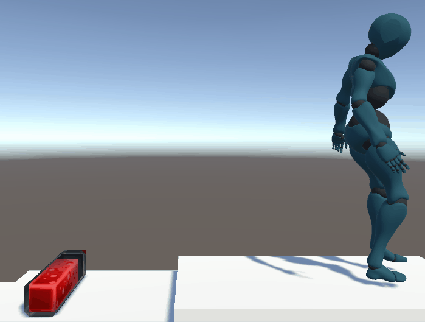
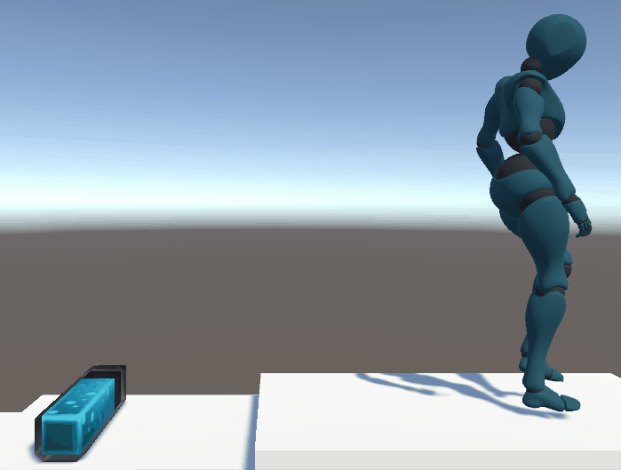
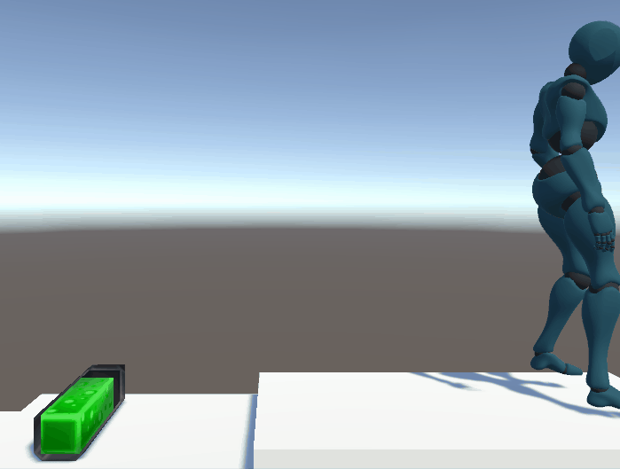
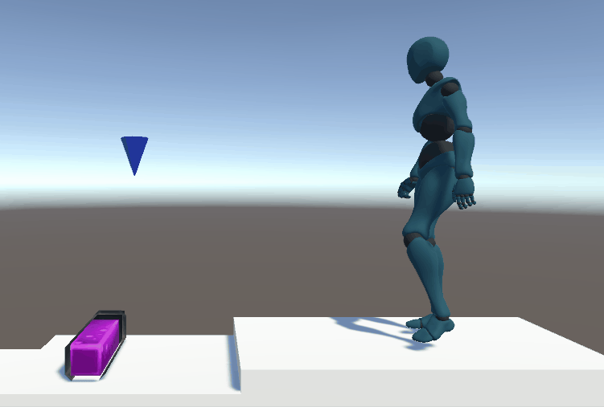

# FiteNite
A Unity game where two players fight agianst each other in a brawler type game. Try to survive and win by damaging the other player and not falling off of the map. 

In this two player game, Player One will use A, W, D, and space to attack while Player Two will use the arrow keys and clicks to attack. Navigate the menus by the mouse and clicking on the sections. The adjust the volume go to options on the main menu.

You are able to select between three different stages that they players are able to move and jump around to fight each other.

##  Stage One 

##  Stage Two 

##  Stage Three 

 Each player has three lives to try and survive. Objects will spawn into the game. Different potions can provide you with either Health or Higher Attack power 

##  Different Potions

###  The Health Potion
The health poriton is a red p[otion that when you walk over it you heal 15 points.

###  The Jump Potion

Increases your jump height
###  The Fast Potion

Increases your move speed

###  The Berserk Potion

Increases Both your move speed and jump height

# Video Demo
## [Software Demo Video](https://youtu.be/L5dg36mrsx4)

# Development Environment

Unity, various Unity Packages, 

We used C# to write the scripts or the files used to make the game run. A library for unity and C# used was MonoBehaviour. 

# Collaborators
Denver Conger, Curtis Nash, Hayden Howard, 
Tanner Denti, Kupu Tu'ifua

# Useful Websites

* [YouTube](https://www.youtube.com/)
* [Mixamo](https://www.mixamo.com/#/)
* [Unity Manual](https://docs.unity3d.com/Manual/index.html)
* [Unity Asset Store](https://assetstore.unity.com/3d)
* [Bible](https://www.churchofjesuschrist.org/study/scriptures/ot?lang=eng)

# Future Work

* Player Defend
* Damage Knockback
* Character Classes
* Different Weapon
* Different Camera Perspective
* Mutliplayer
* Database Backend
* Improved Graphics
* Story
